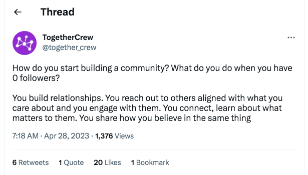

Communities are front and center in web3. The bedrock of a healthy community are the conversations between community members. These interactions will take many forms: Banter, sharing news, saying hi, discussing a topic. Over time, members discover shared areas of interests and values, trust builds and what used to be strangers, are now friends and colleagues co-creating something together that adds value to the community. 

*Seen on: https://twitter.com/rosiesherry/status/1650453470095503364*

By inspecting the foundation of a community, the conversations, it is possible to say how healthy it is. And, as we know from our own human body, health is a precursor for successfully dealing with stress, growth, and longevity. For analyzing conversations, social network analysis is the best approach, as it’s purpose is to investigate the pattern of links within a network. 

In this document we describe how we applied social network analysis to Twitter data. In the first section we describe our data source and how we are transforming a collection of tweets into a social network of users. In this section we will also define a number of terms (User, Connector, Followers). In the following section we will describe our metrics. The twitter metrics are based on user research, scientific evidence, and a competitor analysis. An important insight we gained from the users is that Twitter isn’t just a place for shilling, but also for making friends. Thanks to our three sources of evidence (users, science, competitors) we have created three groups of metrics: Basic engagement metrics, Friendship, and Community insights. For each metric we explain how it is computed and its benefits for users.

# Data source

The user’s community is based on data from Twitter. In the rest of the document we will be using the following terms to describe actors and actions in the network:
- User: The central user whose Twitter community is being analyzed (ego in network terms)
- Connector:  People who have interacted (reply, retweet, quote, mention, like) with the user.
- Follower: Individuals who are following ego’s account (alters in network terms)
- Interaction: An interaction can be any activity that a User or Connector can do on Twitter and is directed to another Twitter account. Concretely this means: lieking, retweeting, replying, or quoting a tweet, or mentioning a User or Connector. 

From  a User we fetch their timeline for the past 7 days. From that timeline, using the tweets we extract Connectors. In addition, we fetch who mentioned the User in the past 7 days. 

For example: The above tweet that appears on our (TogetherCrew’s) timeline has 6 retweets, 1 quote, 20 likes and 1 bookmark. We are not collecting information about who bookmarks tweets. In this example the user is TogetherCrew and the Connectors are those who retweeted the tweet (PeteTownsendNV, DanielOspina, swizzabane, MisterEriki, and bitsikka), those who quoted it (ObeeinWeb3) and the 20 people who liked it. Connectors who engage in two interactions for the same tweet (e.g., retweet and liked) get one edge for each interaction. 

At the end we have a list of Connectors. As we are focusing on the health of the twitter community, we will exclude Connectors who have limited interactions with the user. This ensures that spurious or random interactions are excluded. We begin with setting the threshold to three, thus excluding all Connectors who have interacted less than two times with the user. This threshold is based on scientific research ([Bernardo et al. 2008](https://duckduckgo.com/?t=ffab&q=Social+networks+that+matter%3A+Twitter+under+the+microscope&atb=v344-1&ia=web)). We will test if this threshold (min(Interaction) = 3) is valid for the Twitter data we are collecting. In the future, we will consider setting the threshold dynamically based on the users interaction data. 

To create a full network and not just an ego-network, from this list of Connectors we fetch their timeline and extract all interactions with other Connectors. 

# Metrics

The Twitter metrics are grouped into three categories. These categories have an increasing level of depth and connectivity: 
1. Basic engagement
2. Friendships
3. Community vibes. 

The metrics in the dashboard will summarize the activity over a 7-day period.

The basic engagement metrics provide the basic information Users would expect from any Twitter analytics solutions.They do not go into depth. Just like most clothes fulfill the function of covering you up, the basic engagement section fulfills the minimum requirement that is expected from a social media analytics solution.  

The following two sections, Friendships and Community vibes, go beyond what is offered by other Twitter analytics solutions. Continuing with the clothes analogy, clothes that keep you covered and make you look good (or are functional) are more desirable. The knowledge gained from Friendships and Community vibes sections are just like that: more desirable than the basic engagement numbers, because they put conversations and showing support for each other at their core. 

The data is stored in a neo4j database. There are two types of nodes in the database: users and tweets. The edges are named: tweeted, liked, retweeted, quoted, mentioned, replied. From this data, interactions between different accounts are summed into the interaction network where the edges are weighted by number of times two accounts interacted with each other within the past 7 days.

## Basic engagement 
 

### Follower count
Definition: Number of followers the user has.

For Users to get feedback on the effectiveness of their Twitter strategy, these are the basic numbers. These are traditional Twitter metrics users are familiar with. 

### Number of posts users made
Definition: Absolute number of posts made during the past 7 days. This will be 0 if no posts were made. 
Replies, mentioned, retweets and quotes are included. 
Likes are excluded. It will be operationalized as `Sum of degree of [engagement_type] relation in neo4j over all tweets from user`.

Number of posts is a reminder for the user about what they did on Twitter. If you don’t post, you’re not connecting with your community.

### Number of likes, retweets, replies, mentions  and quotes that the user received
Definition: Total number of received likes, retweets, replies, mentions and quotes received during the past 7 days. It is operationalized as `Sum of degree of [engagement_type] relation in neo4j over all tweets from user`

This shows the user which tweet got the highest level of engagement and will help decide on what content is engaging for the audience

## Friendships
In this section, we go beyond followers and show the metrics about the Connectors, the Twitter accounts who interact with the User.

### Friendship circle
Definition: Number of connectors operationalized as `Sum (connectors)`

This shows the number of people with whom a user has a conversation.

### Your friend-type
Definition: The level of support a Connector provides to the User based on how they interact with the user.
The User will see three levels of support:
- Acquaintance: number of Connectors who only retweet or like (`sum of connectors who retweet | like`)
- Supporters: Number of connectors who reply, mention, or quote (`sum of connectors who reply | mention | quote`)
- Ambassadors: Number of connectors who do at least two distinct action (reply, mention, quote) (`sum of connectors who [(reply & mention) | (reply & quote) | (quote | mention)]`)

Depending on how the User is using Twitter, these metrics show them how many supporters or ambassadors they have in the network. 

A low number of supporters and ambassadors indicates that the User isn’t connecting with the right people.

Limitation: We are not taking the post of the content in the account. Thus the user needs to know their own context. A user who is part of a highly toxic environment where Twitter is used to troll people will want to see a low number of ambassadors. 

## Community vibes

A community is here operationalized as the User and the connectors. These are linked through their interaction (replies, retweets, quotes, and mentions). In the computation of community insights we do not make a distinction between the type of edge (reply, retweet, quote, mention), the content or sentiment of the tweet. Everything is weighted equally.

### Community type 

Based on prior work on Twitter communities, this describes the type of community a user is building based on the interactions they are having on Twitter. Four types exists:

- Audience: In this community, information is broadcasted out to an audience, but the audience does not interact a lot with the main account. Very few accounts are in the center of this network, just a couple of expert accounts. This is a typical structure for news outlets or customer support accounts. 
- Polarized Community: This is a divided community. Here, the community has two or more subgroups with very little interactions between them. This is a typical structure of highly divisive topics. 
- Tight Community: This is a unified community with a high level of interactions between members. This is a typical structure for conferences, niche topics, or hobby groups.
- Healthy Community: In this community there is no single member who controls the narrative in the community. Small subgroups exist, but they are communicating with each other. 

To group a User's network into one of these community types, we calculate the density, modularity, centralization, isolates, and direction of centralization. Based on these, the community is characterized using the below presented schema.

- Density: For undirected network (edge from A to B or from B to A or both is considered as an edge): `num_edges / (num_nodes * (num_nodes-1)`)
- Modularity: For modularity we are first [detecting communities](https://docs.google.com/document/d/1u1_1z-N8cDNYeAyjIXs2wCa1VaL8dlJDFM3bwrBygC8/edit#:~:text=Detect%20communities%20first%3A-,https%3A//neo4j.com/docs/graph%2Ddata%2Dscience/current/algorithms/degree%2Dcentrality/,-Then%20compute%20modularity) and then calculating the strength of the communities ([modularity](https://neo4j.com/docs/graph-data-science/current/algorithms/alpha/modularity/)) 
- [Centralization](https://docs.google.com/document/d/1u1_1z-N8cDNYeAyjIXs2wCa1VaL8dlJDFM3bwrBygC8/edit#:~:text=https%3A//neo4j.com/docs/graph%2Ddata%2Dscience/current/algorithms/degree%2Dcentrality/): The degree to which the centrality of the most central point exceeds the centrality of all other points” ([Freeman, 1979, p. 227](https://doi.org/10.1016%2F0378-8733%2878%2990021-7)).
- Isolates: Count of number of nodes with 0 degree in degree centralization output.

Based on these metrics, we use the following decision tree to group Twitter communities as either audience, polarized community, tight community, and healthy community. 

[Twitter Community Type](Twittercommunitymodel.png)